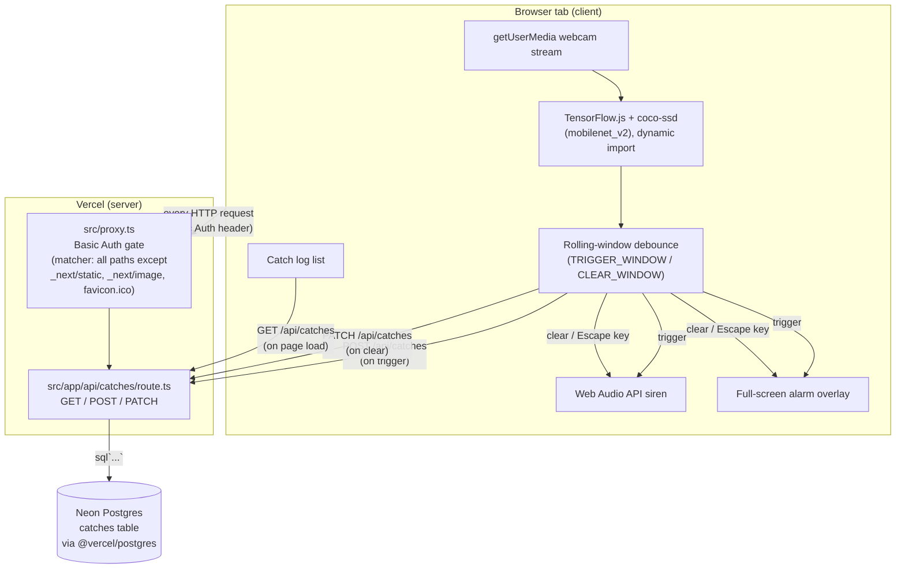

# ARCHITECTURE.md — Technical Architecture Reference

## System overview

Phone Watchdog (web) is a single-page Next.js 16 App Router application.
Almost the entire feature — webcam capture, ML-based phone detection, the
alarm — runs **client-side in the browser tab**. The server side is
deliberately minimal: one Basic Auth gate (`src/proxy.ts`) and one API
route (`src/app/api/catches/route.ts`) backed by a single Postgres table.
There is no real-time channel, no background job, no queue, and no
server-side rendering of anything detection-related (the page that shows
the video/alarm is a client component).

## Architecture diagram

## Frontend structure

- **Entry point:** `src/app/layout.tsx` (Server Component) — wraps
  everything in `<html>`/`<body>`, loads Geist/Geist Mono fonts via
  `next/font/google`, sets page `<title>`/`description` metadata. No
  navigation, no providers, no context.
- **The one page:** `src/app/page.tsx` (`"use client"`, default export
  `Home`). All state lives here: refs for the video element, media
  stream, loaded model, detection interval timer, rolling sample buffer,
  siren-stop callback, and the current in-flight catch's DB id; plus
  React state for model-loading/running/caught/error/log.
- **No component decomposition.** The entire UI (video element, start/
  stop button, error text, catch log list, full-screen alarm overlay) is
  inline JSX inside the single `Home` component — there is no
  `src/components/` directory.
- **No client-side routing beyond the implicit Next.js `_not-found`.**

## Backend structure

- **`src/proxy.ts`** — exported `proxy(req)` function (Next 16's renamed
  `middleware.ts` convention). Runs before every request matched by
  `config.matcher` (everything except `_next/static`, `_next/image`,
  `favicon.ico`). Checks `process.env.SITE_PASSWORD`; if unset, passes
  the request through unchanged (local-dev convenience). If set, requires
  a matching HTTP Basic Auth header or returns `401` with a
  `WWW-Authenticate` challenge.
- **`src/app/api/catches/route.ts`** — three exported handlers
  (`GET`/`POST`/`PATCH`), each independently calling a local
  `ensureTable()` helper (idempotent `CREATE TABLE IF NOT EXISTS`) before
  querying. No shared server-side module beyond the `@vercel/postgres`
  `sql` tagged template import. No other server code exists anywhere in
  the repo.

## Request lifecycle (a single detection → alarm → log cycle)

1. User clicks **Start**. `start()` (`page.tsx`) calls
   `navigator.mediaDevices.getUserMedia(...)`, attaches the resulting
   `MediaStream` to the `<video>` element, resets the sample buffer, and
   flips `running` to `true`.
2. A `useEffect` keyed on `running`/`runDetection` starts a
   `setInterval(runDetection, 300)`.
3. Every 300ms, `runDetection()` calls `model.detect(video, 20, 0.35)`
   (coco-ssd inference against the current video frame, entirely
   client-side, no network call), checks whether any prediction has
   `class === "cell phone"`, and pushes that boolean into a rolling
   sample buffer capped at `CLEAR_WINDOW` (10) entries.
4. If not currently `caught`: looks at the last `TRIGGER_WINDOW` (6)
   samples; if at least `TRIGGER_HITS` (3) of them are `true`, calls
   `triggerAlarm()`.
5. `triggerAlarm()` sets `caught = true`, starts the Web Audio siren
   (`startSiren()`), and fires `POST /api/catches` (no body). The request
   passes through `proxy.ts` (Basic Auth re-checked on every request —
   there's no session, so this happens on every single fetch), reaches
   `route.ts`'s `POST` handler, which calls `ensureTable()` then inserts a
   row (`caught_at = NOW()`), returning the new row's `id`. The client
   stores that `id` in `currentCatchIdRef` and refreshes the visible log
   via `GET /api/catches`.
6. While `caught`, subsequent samples still accumulate in the same
   rolling buffer (now evaluated against `CLEAR_WINDOW`/`CLEAR_HITS`): if
   all 10 of the last samples are `false` (phone fully absent for ~3s),
   `dismiss()` runs automatically. The user can also press **Escape** at
   any time to call `dismiss()` immediately (a separate `useEffect` wires
   the `keydown` listener only while `caught` is true).
7. `dismiss()` calls `clearAlarm()` (stops the siren, `caught = false`)
   and `closeCurrentCatch()`, which fires `PATCH /api/catches` with the
   stored `id`, setting `cleared_at = NOW()` on that row, then refreshes
   the log again.
8. Both the `POST` and `PATCH` fetches are best-effort: any network/DB
   failure is caught and silently ignored client-side — the alarm's
   trigger/clear behavior never depends on the network call succeeding.

## Data flow

Detection state (video frames, model predictions, the rolling sample
buffer) never leaves the browser. Only three pieces of data cross the
network: (1) the `POST` that creates a catch row, (2) the `PATCH` that
closes it, (3) the `GET` that lists the last 100 rows for display. No
video frame, image, or model output is ever sent to the server — the ML
inference is 100% local.

## Authentication flow

See "Authorization flow" — there is no user-identity concept, only a
single shared-secret gate. `proxy.ts` runs on every matched request
(pages and API routes alike) and checks the `Authorization: Basic
<base64(username:password)>` header's password segment (the username
segment is not checked/used at all) against `SITE_PASSWORD`. No cookies,
no sessions, no tokens — the browser's native Basic Auth prompt/cache is
the entire "session" mechanism (handled by the browser, not this app).

## Authorization flow

Binary: either the request carries the correct shared password (full
access to every page and every API operation) or it doesn't (`401`
everywhere). There is no role, no per-resource permission, no ownership
check anywhere in `route.ts` — any authenticated caller can read, create,
or clear *any* catch row, not just "their own" (there's no concept of
"whose" a catch is).

## Database access flow

`route.ts` imports `sql` from `@vercel/postgres`, which lazily opens a
connection using `process.env.POSTGRES_URL` on first query (confirmed by
reading the package's own source — it is not passed a connection string
explicitly anywhere in this repo's code). Every handler is one or two
tagged-template `sql` calls; there is no ORM, no query builder, no
connection-pooling code written by this app (that's `@vercel/postgres`'s
job internally). See `DATABASE.md`.

## Storage flow

No file/blob storage of any kind (no images, no uploads, no Vercel Blob/
S3 usage found anywhere in the repo).

## External API / integration flow

None beyond the browser's own `navigator.mediaDevices` (a browser API,
not a network call) and Google Fonts fetched at **build time** by
`next/font/google` (not a runtime client request — Next.js self-hosts the
resulting font files).

## Background / scheduled jobs

None. No cron, no queue, no worker process. `ensureTable()` running on
every request is the closest thing to recurring server work, and it's
triggered by user action, not a schedule.

## Caching

None implemented explicitly. Next.js's default caching behavior applies
to the static route segments (`/`, `/_not-found`, `/icon.svg`, all
prerendered as static per the `next build` output observed this audit);
`/api/catches` is dynamic (`ƒ` in the build output) and not cached.

## Error handling

- **Client:** webcam permission/access failures surface to the user via
  `setError` and a visible `
`. All other
  failure paths (DB fetch failures) are swallowed silently
  (`.catch(() => {})`) — the detection/alarm loop is designed to never be
  blocked or crashed by a network/DB problem.
- **Server:** every `route.ts` handler wraps its body in `try/catch` and
  returns `NextResponse.json({ error: "database not configured", detail:
  String(err) }, { status: 500 })` on any failure — this message is
  reused for all failure types, not just missing-config cases (see
  `CLAUDE.md` "Known issues").
- **`proxy.ts`:** returns a plain-text `401` with a `WWW-Authenticate`
  header on any auth failure; no error is thrown, no logging occurs.

## Logging

No structured logging exists anywhere in the app. No `console.log`/
`console.error` calls were found in `src/` (verified via grep). Errors
that reach a `catch` block are serialized into the JSON error response
(`String(err)`) but not otherwise recorded — there is no log
aggregation, no Sentry/error-tracking SDK.

## Deployment architecture

Single Vercel project (`phone-watchdog-web`) serving both the static/
prerendered pages and the one dynamic API route as Vercel Functions.
Postgres is a separate Neon-provisioned database connected via Vercel's
integration (its connection details arrive as env vars, not as
infrastructure defined in this repo). See `DEPLOYMENT.md` for the full
breakdown, including the live-verified production URL behavior.

## Security boundaries

The only boundary in this app is `proxy.ts`'s shared-password check.
Once past it, there is no further boundary anywhere — client and server
trust each other completely, and the database has no row-level
authorization. See `SECURITY.md` for the full defensive review.

## Major architectural risks

1. **Single shared secret gates everything, with no rate limiting.** A
   leaked `SITE_PASSWORD` (or a brute-forced one, since Basic Auth has no
   built-in throttling and this app adds none) grants full read/write
   access to the catch log and the ability to spam `POST`/`PATCH`
   indefinitely.
2. **No schema migration system.** `ensureTable()`'s
   `CREATE TABLE IF NOT EXISTS` is the entire schema-management story. Any
   future column addition/change has no established, safe migration
   path in this repo — it would need to be designed from scratch.
3. **Detection accuracy is entirely dependent on a third-party pretrained
   model** (`coco-ssd`'s `"cell phone"` class) with no fallback, no
   confidence calibration beyond a hand-tuned threshold, and no way to
   improve accuracy short of re-tuning the debounce constants — there is
   no training/fine-tuning pipeline in this repo.
4. **Best-effort/fire-and-forget DB writes mean the catch log can silently
   diverge from reality** (e.g. a `POST` that fails leaves `caught` state
   true in the UI with no corresponding DB row; a `PATCH` that fails
   leaves a row permanently `cleared_at: null` even though the alarm
   visually cleared) — acceptable for a personal accountability tool, but
   worth knowing if the log is ever relied on as an accurate record.
