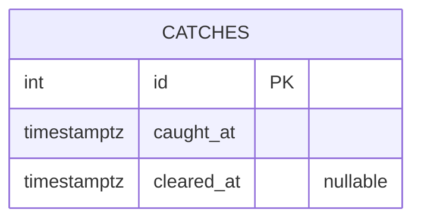

# DATABASE.md — Storage Model

## Provider

**Postgres**, accessed via `@vercel/postgres` `0.10.0`. The connection
string comes from `process.env.POSTGRES_URL` (confirmed by reading
`@vercel/postgres`'s own source,
`node_modules/@vercel/postgres/dist/chunk-7IR77QAQ.js`, which reads
`process.env.POSTGRES_URL` for the pooled connection and
`process.env.POSTGRES_URL_NON_POOLING` as a fallback for the
non-pooling path — this app only ever uses the default `sql` export, so
only `POSTGRES_URL` is actually exercised).

The underlying database is **Inferred to be Neon Postgres**, provisioned
through Vercel's Postgres/Neon marketplace integration — inferred from
the full set of `NEON_*`/`PG*`/`POSTGRES_*`/`DATABASE_URL*` env var names
present both in `.env.local` and configured on the Vercel project
(confirmed via `vercel env ls`, names only). This is the standard
variable set Vercel's Neon integration auto-populates; no code in this
repo names "Neon" directly, so this is inference from the variable
pattern, not a direct statement in the app's own code.

## Schema source

**There is no migration file or schema file anywhere in the repo.** The
entire schema is defined inline, as a `CREATE TABLE IF NOT EXISTS`
statement inside `ensureTable()` in
`src/app/api/catches/route.ts`, executed at the top of every `GET`/
`POST`/`PATCH` handler (idempotent, safe to repeat, but not free — every
request pays for the check).

## Tables

### `catches` — the only table

```sql
CREATE TABLE IF NOT EXISTS catches (
  id SERIAL PRIMARY KEY,
  caught_at TIMESTAMPTZ NOT NULL DEFAULT NOW(),
  cleared_at TIMESTAMPTZ
);
```

| Column | Type | Nullable | Default | Meaning |
|---|---|---|---|---|
| `id` | `SERIAL` (integer, auto-increment) | No (PK) | auto | Row identifier, returned to the client on `POST` and used as the `PATCH` target |
| `caught_at` | `TIMESTAMPTZ` | No | `NOW()` | When the alarm triggered |
| `cleared_at` | `TIMESTAMPTZ` | **Yes** | `NULL` | When the alarm was dismissed (auto-clear or Escape key); `NULL` means still open/uncleared, or the `PATCH` that would have set it never happened/failed |

- **Indexes:** Only the implicit primary key index on `id`. No index on
  `caught_at` despite `GET` sorting by it — at the scale this app
  operates at (a personal tool, at most a handful of rows per day) this
  is not a practical concern, but would matter if row count ever grew
  large.
- **Constraints:** Only `NOT NULL` on `id`/`caught_at` (via the primary
  key and the explicit `NOT NULL`). No `CHECK` constraints (e.g. nothing
  enforces `cleared_at >= caught_at`).
- **Enums:** None.
- **Relationships:** None — a single, unrelated table. No foreign keys,
  no user table to relate to (there is no user/account concept at all —
  see `SECURITY.md`).

## Migrations

**None exist.** `ensureTable()`'s `CREATE TABLE IF NOT EXISTS` is the
entire schema-management story. This has real consequences:

- Adding a new column requires **manually altering the live database**
  (e.g. via a one-off `ALTER TABLE` run by hand, or Neon's own console/
  CLI) — editing the `CREATE TABLE` statement in `ensureTable()` alone
  will **not** retroactively add the column to an already-existing
  table, since `IF NOT EXISTS` means the statement becomes a no-op once
  the table exists.
- There is no down-migration/rollback path defined anywhere.
- There is no migration history/version tracking (no `schema_migrations`-
  style table, no migration framework like `node-pg-migrate`,
  `drizzle-kit`, or Prisma Migrate installed).

## Seeds

None exist. No seed script, no fixture data.

## RLS policies

**None.** This is plain Postgres accessed via a service-role-style
connection string (`POSTGRES_URL`), not Supabase-style client-side access
with row-level security — RLS is not a concept `@vercel/postgres`'s
server-side `sql` usage relies on here. All access control happens one
layer up, at the HTTP level, via `src/proxy.ts`'s Basic Auth gate — not
in the database at all.

## Ownership / deletion rules

**None.** Every row is globally visible/mutable to anyone who passes the
site's shared password — there is no `user_id`/owner column, and no
`DELETE` endpoint exists in `route.ts` at all (only `GET`/`POST`/
`PATCH`). The only way to remove a row would be a direct database
operation outside this app's API.

## Storage buckets

None. No file/blob storage integration found anywhere in the repo.

## Sensitive data

The `catches` table itself contains no personally identifying or
sensitive data beyond two timestamps — it records *when* a phone was
seen, not any image, video, or identity. The actually-sensitive material
in this system is entirely in environment variables (the Postgres
connection string, which grants full read/write to the database, and
`SITE_PASSWORD`), never in table rows.

## Migration risks

1. **Editing `ensureTable()`'s `CREATE TABLE` statement does nothing to
   an already-existing table.** Any future column addition needs a
   manual, separate `ALTER TABLE` applied directly against the live
   database (or a real migration tool adopted) — this is the single
   biggest risk in this system for future schema evolution.
2. **`ensureTable()` runs on every single request.** Currently harmless
   (a `CREATE TABLE IF NOT EXISTS` against an existing table is cheap),
   but if this pattern is ever extended to something less idempotent-safe
   (e.g. an `ALTER TABLE ADD COLUMN` without an `IF NOT EXISTS` guard),
   it would fail loudly on the second-and-later request rather than
   once.
3. **No backup/restore process is documented or automated in this repo.**
   Whatever backup guarantees exist are whatever the Neon plan/tier
   provides by default — not something this app configures or relies on
   explicitly.

## Entity relationship diagram



Just the one table — there is nothing to relate it to.
